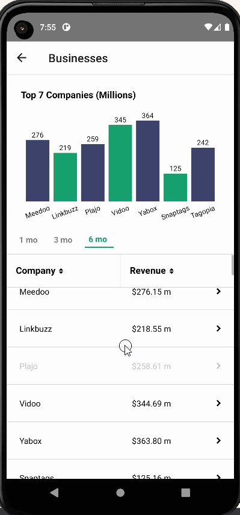

# Business Intelligence
Shows a list of businesses and their revenue.
The list is sortable by company name as well as total revenue for the given time frame.
The timeframe "chips" are for 1, 3 and 6 months of revenue.
Bar Graph will automatically re render upon sorting/selecting time frame.

Upon selection of a company in the list, you will be navigated to a new drilldown screen of that company.
You will see a table of their 6 months of data as well as a line graph displaying this data.

## Setup
* In your terminal, clone the repository: `git clone https://github.com/Andrewrf/BusinessIntelligence.git`
* `cd BusinessIntelligence`
* `npm install`
* This app is meant for Android, please be sure you have your JAVA_HOME set in your environment variables. For more information on Android setup please visit [here](https://reactnative.dev/docs/environment-setup)
* Depending on your CLI, run either `npm run android` or `npx react-native run-android`